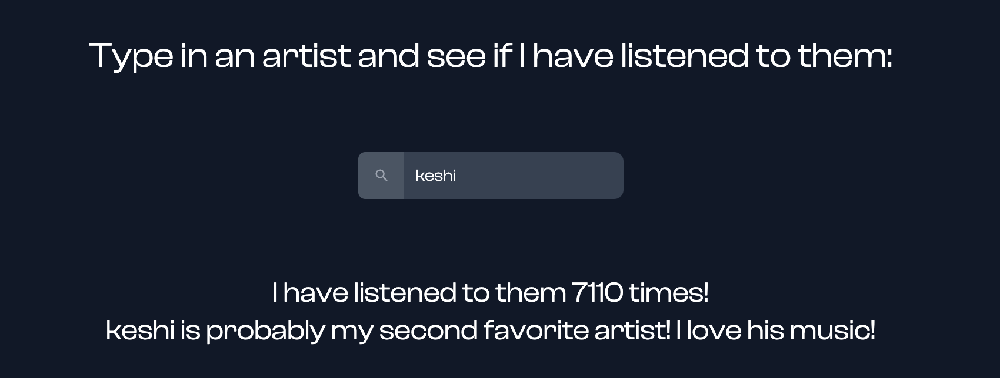

I remake my personal page [keyruu.de](https://keyruu.de) every year or so in a new web stack I find interesting. This year I was very interested in HTMX because of [ThePrimeagen](https://www.youtube.com/c/theprimeagen). The idea of not having to deal with JavaScript/TypeScript shenanigans piqued my interest.

Firstly I wanna share my thoughts on language and framework wars. You can do pretty much everything with everything. If you really want to you can write your backend in bash ([yes this has been done](https://github.com/dzove855/Bash-web-server)). It's all just preference, and you should code in the language and framework you are most comfortable with and with what you think does the job best. 

Having said that I also want to say that I used Vue/Nuxt and Svelte/SvelteKit for this project in the past and there are benefits to the frontend framework approach, like bigger community, awesome components libraries, big ecosystem, etc. For heavy interactivity apps I do think it's better to be closer to the browser and deal with the stuff on the client. A good example for this would be Google Sheets or Google Maps.

For other stuff that is maybe smaller in scope or just displays HTML with little bits of interactivity this approach and stack is perfect.

> What are you building?

A personal website to display interests, my music and showcase some of my backend ideas.

# Parts of this stack

## [htmx](https://htmx.org/)

With this rebuild of my site I really noticed how much of my site is just HTML. Just stuff that needs to be rendered but isn't interactive at all. I noticed that it's actually weird to write a bunch of "client" code that the surrounding framework executes on the server, so SEO is actually being considered. The industry pivoted to SPAs because we didn't want to do everything on the server and then noticed the crawlers don't want to do everything on the client. So then we do most of the stuff on the server again, so crawlers are happy and Google actually shows our page in search results. Kind of funny if you think about it right?

Why not write the stuff directly for the server and let HTML take care of interactivity. If you think about it the HTML can do the necessary stuff already, navigating to new pages. Scale that down to just letting the browser replace parts of the HTML instead of the whole thing, and you have [htmx](https://htmx.org/). The gist is that you can set attributes on HTML tags and the htmx in the browser takes care of swapping stuff in and out. 

Quick example for submitting something:
```html
<button hx-post="/submit" hx-swap="outerHTML">Submit</button>
```
The client doesn't even need to check if the request was successful or not because the server can just send the right the HTML to display the stuff. 

Success:
```html
<h1 style="color: green;">Success!</h1>
```
Failure:
```html
<h1 style="color: red;">Epic fail...</h1>
```

I hope you got the core concept. If you still don't quite get it or want to learn more about htmx watch this [video by ThePrimeagen](https://www.youtube.com/watch?v=x7v6SNIgJpE).

## [Go](https://go.dev/)

I definitely wanted a statically typed language, I'm not trading JS with some language that also has dynamic typing. I did think about using Rust for this, but I'm not that experienced with Rust. Furthermore, I already wrote some small programs in Go, and it's very easy to prototype a concept. The next two parts of the stack were also what drove me to Go.

## [PocketBase](https://pocketbase.io/)

This is an awesome little CMS. Think of this as having a built-in admin panel for your app to manage your data. You can extend it with your own business logic and develop your own app on top of it. Built in support for files on S3, built in backups and migrations. All of this makes for the perfect base to build your personal page that has data that changes sometimes. My use case for this is managing my music releases and my interests. If I release a new song I just type in my new release, upload the cover and add the links to it.


## [templ](https://templ.guide/)

For using htmx you should have a backend that generates HTML. Go already has a built-in templating solution, but it isn't type safe. I don't really see a big benefit then compared to JS. 

In comes templ which is an awesome Go library that generates Go code from `.templ` files. This is pretty awesome because you can also have plain Go functions in the same file as the component. This makes colocating logic for that component easier. Templ also ships with a live reload mode and has the advantage that it's mostly just HTML instead of a custom syntax, so you can copy and paste right into your template.

I do find that the control flow of templ is more readable than most frontend frameworks. 

Compare React:
```jsx
{color === "white" && <p>white</p>}
```
with templ:
```go
if color == "white" {  
	<p>white</p>  
}
```

Templ also has a good way to actually provide CSS classes that don't collide with other ones in your app by generating them with a unique ID.

One disadvantage is that the language server sometimes was a bit bugged. I needed to restart it several times during development.

I can recommend reading [the documentation](https://templ.guide/) for getting familiar with templ.

## [TailwindCSS](https://tailwindcss.com/)

I think most people already know Tailwind and why it's better than writing classes, but if you wanna read up on it [here you go](https://adamwathan.me/css-utility-classes-and-separation-of-concerns/).

I do write some CSS classes for stuff you can't really do with Tailwind or where I want to. Deal with it.

## [AlpineJS](https://alpinejs.dev/)

Using htmx doesn't have to mean you don't use JS at all. So for the small parts where I need client interactivity I use Alpine. This also plays well with the hypermedia approach of htmx because you actually define the state on the HTML tags and don't write JS.

# Journey

## Rethinking frontend

It really was a big shift in my head to do everything on the server. No client state and no lifecycle, but after I got a bit more comfortable with everything I felt a weight being lifted off my shoulders. This way of developing UIs is sooo much easier than dealing with hooks, state, re-renders, onMount, onDestroy, etc. It's just HTML. 

## Dealing with a carousel

I quickly noticed that I do have a big thing with client heavy interaction. This is my carousel/swiper for my releases. It looks like this:
I used a web component for this in Vue called [Swiper.js](https://swiperjs.com/). I thought about doing this in htmx and immediately threw that idea out the window. This would've been a huge time sink and I would never have gotten it that accessible and smooth as Swiper.js (I know that this is a skill issue but I don't care). So I just kept Swiper.js.

Easy right? Yeah, not really with how I had it implemented. The actual carousel is only the covers, the text and the links change with the changed slide (client state). For this I used AlpineJS. 

I just put the data into `x-data` of the parent `div`.
```templ {25} title="releases.templ"
func getDataAsJs(releases []models.Releases) string {
	var sb strings.Builder
	sb.WriteString("[")
	for _, release := range releases {
		sb.WriteString("{")
		sb.WriteString(fmt.Sprintf("songtitle: '%s',", release.Songtitle))
		sb.WriteString(fmt.Sprintf("artists: '%s',", release.Artists))
		sb.WriteString(fmt.Sprintf("slug: '%s',", release.Slug))
		sb.WriteString(fmt.Sprintf("primary_color: '%s',", release.PrimaryColor))
		sb.WriteString(fmt.Sprintf("apple: '%s',", release.Apple))
		sb.WriteString(fmt.Sprintf("spotify: '%s',", release.Spotify))
		sb.WriteString(fmt.Sprintf("youtube: '%s',", release.Youtube))
		sb.WriteString("},")
	}
	sb.WriteString("]")
	return sb.String()
}

...

templ Releases(releases []models.Releases, initialSlide int, history bool) {
	<div class="text-gray-600 body-font my-auto overflow-hidden">
		<div
			class="mx-auto flex flex-col px-5 justify-center items-center"
			x-data={ fmt.Sprintf("{ index: %d, releases: %s }", initialSlide, getDataAsJs(releases)) }
		>
			...
		</div>
	</div>
}
```

Then I just use the data of the current slide like this:
```templ {22,26-27} title="releases.templ"
templ Releases(releases []models.Releases, initialSlide int, history bool) {
	<div class="text-gray-600 body-font my-auto overflow-hidden">
		<div
			class="mx-auto flex flex-col px-5 justify-center items-center"
			x-data={ fmt.Sprintf("{ index: %d, releases: %s }", initialSlide, getDataAsJs(releases)) }
		>
			<div class="custom-swiper flex items-center justify-center mb-10">
				<swiper-container
					...
				>
					for _, release := range releases {
						<swiper-slide
							class="flex items-center justify-center"
							data-history={ release.Slug }
						>
							@Cover(release)
						</swiper-slide>
					}
				</swiper-container>
			</div>
			<div
				:style="`background: ${releases[index].primary_color}`"
				class="h-full px-4 overflow-hidden text-center relative py-0.5"
			>
				<h1 class="title-font sm:text-4xl text-3xl font-medium text-gray-900 flex">
					<strong x-text="releases[index].songtitle"></strong>&nbsp—&nbsp
					<p x-text="releases[index].artists">test</p>
				</h1>
			</div>
		</div>
	</div>
}
```

I still have to manage something else though. On the dedicated site for my releases it should change the title when you change the slide. And I'm actually using JS for this, look at this:
```templ title="releases.templ"
<script type="text/javascript">
	function onSlideChange(event) {
		this.index = event.detail[0].activeIndex;
		if(document.location.pathname.startsWith("/music")) {
			document.title = `Keyruu - ${this.releases[this.index].songtitle}`;
		}
	}
</script>
...
		<swiper-container
			@swiperslidechange="onSlideChange"
			...
>...</swiper-container>
...
```
And I can live with that.

## Rebuilding stuff with htmx

### Tech interests

My tech interests are three tabs, DevOps, Frontend and Backend.

Porting this to htmx wasn't hard at all. It's basically just [this example](https://htmx.org/examples/tabs-hateoas/). 

This is my code:
```templ title="fullstack.templ"
templ stackButton(name string, selected bool) {
	<h1
		class={ "m-4 lg:m-6 font-bold text-sm lg:text-xl p-2 lg:p-4 border-[1px]",
			"hover:bg-white hover:text-black cursor-pointer uppercase",
			templ.KV("bg-white text-black", selected) }
		hx-get={ "/fullstack?type=" + name }
		hx-target="#fullstack"
	>{ name }</h1>
}

templ Fullstack(stack []models.Fullstack, selected string) {
	<div id="fullstack-content">
		<div class="flex flex-row justify-center my-8">
			@stackButton("devops", selected == "devops")
			@stackButton("frontend", selected == "frontend")
			@stackButton("backend", selected == "backend")
		</div>
		<div
			class={ "fullstack w-screen flex justify-center items-center py-14 h-[66vh]", 
			components.BgWithScaling(utils.GetEnv(ctx).BaseUrl + "/gradient/subtle-gradient.png", 1440, 640) }
		>
			@InfoBox(stack)
		</div>
	</div>
}
```
And that's all the interactivity it needs. Pretty neat.

It just replaces the whole `Fullstack` component, with the new selected type.

### Have I listened to?

You can check how many times I have listened to which artist on my site.


For this I also wanted to display something when the server takes a bit to respond:
```templ title="have_i_listened_to.templ"
templ HaveIListenedTo() {
	<style>
    [data-loading] {
      display: none;
    }
	</style>
	<div
		class="..."
		hx-ext="loading-states"
	>
		<h1 class="text-3xl m-8">
			Type in an artist and see if I have listened to them:
		</h1>
		<form hx-put="/lastfm" hx-target="#lastfm-answer" class="form-control m-8">
			<div class="flex">
				<span class="...">
					<span class="iconify mdi--search"></span>
				</span>
				<input
					type="text"
					name="artist"
					class="..."
					data-loading-disable
					placeholder="Search for an artist…"
				/>
			</div>
		</form>
		<p data-loading class="text-2xl m-8"><span class="iconify mdi--loading animate-spin"></span>&nbsp;I wonder if I like them...</p>
		<div id="lastfm-answer" data-loading-class="hidden"></div>
	</div>
}

templ LastfmAnswer(playcount int, comment string) {
	<p class="text-2xl mt-8 text-center">I have listened to them { fmt.Sprint(playcount) } times!</p>
	<p class="text-2xl mb-8 text-center">{ comment }</p>
}
```
On submit it fetches the answer and puts it inside the `div` with ID `lastfm-answer`. This uses the [loading-states extension](https://github.com/bigskysoftware/htmx-extensions/blob/main/src/loading-states/README.md) that makes showing loading components very easy.

## Live Spotify activity

I fetch my current playback info of Spotify every 5 seconds and send the update to the client. 

htmx has extensions for [websockets](https://github.com/bigskysoftware/htmx-extensions/blob/main/src/ws/README.md) and [server-sent-events](https://github.com/bigskysoftware/htmx-extensions/blob/main/src/sse/README.md), because I only want to communicate with the client and not the other way around I chose SSE. For this I use the awesome [sse library by r3labs](https://github.com/r3labs/sse) in conjunction with [echo](https://echo.labstack.com/) because that's what PocketBase uses.

```html title="spotify_activity.templ"
<div hx-ext="sse" sse-connect="/spotify?stream=spotify" sse-swap="message" hx-swap="innerHTML" id="sse">
	<p class="h-[500px]">
		Waiting for song...
	</p>
</div>
```
This connects with the SSE endpoint and gets the `SpotifyActivity` component every 5 seconds and replaces the `innerHTML` of the `div`. This is just awesome!

# Closing remarks
Using this stack was so much fun and I will definitely build on top of this or look into other languages with using htmx, but for me htmx is just the perfect solution for personal projects like this. Check out the [source code](https://github.com/Keyruu/traversetown-htmx/tree/master) and the [live site running this stack](https://keyruu.de).

Please put name suggestions for this stack in the comments :D