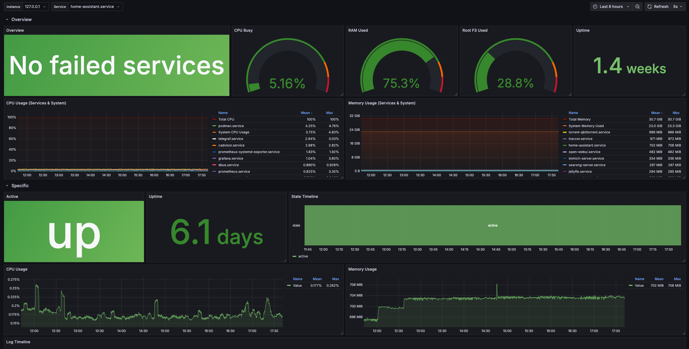

I use NixOS to manage my homelab and it has been awesome to have my whole homelab defined in one Git repo. Read more about what I love about NixOS [[NixOS for Servers|here]] and read about why I use containers (Docker) with Nix instead of just Nix [[Docker Compose on NixOS|here]].

In my Docker Compose article I talk about running `docker compose` inside a systemd service. Also why I didn't use any of the other Nix-based options.
But my solution had some drawbacks:

- All containers have one log output to the systemd service
- The CPU and Memory metrics are not correct, because they do not belong to the same cgroup
- You can't use systemd controls to control the individual containers
- The restart trigger will restart the whole docker compose

So, as you can see this is not an ideal solution.

But as an avid homelabber, I, of course, have to rewrite my setup every few years and that led me to Quadlet.

I found this by accident through some podman documentation link I've found, and I've never heard anyone talk about this before. But I read through the docs, and it sounded like _the_ perfect solution for my use-case.

I just wanna be able to define every part of a compose stack with Nix and don't wanna miss out on features like `depends_on` or network creation.

# But what is quadlet?

Quadlet is a podman feature that allows you to define systemd-like units to create a proper systemd service that runs a container, creates a network or a volume (and it can do more, read about it [here](https://docs.podman.io/en/latest/markdown/podman-systemd.unit.5.html)). It introduces new unit fields that can describe these resources. Here is an example:

```systemd
[Unit]
Description=A templated sleepy container

[Container]
Image=quay.io/fedora/fedora
Exec=sleep %i

[Service]
# Restart service when sleep finishes
Restart=always

[Install]
WantedBy=multi-user.target
DefaultInstance=100
```

Pretty straightforward right?

Regarding the `depends_on` feature, because quadlet uses systemd units, systemd can handle service dependencies and startup order.

## quadlet-nix

The problem for me is I don't really wanna write systemd units by hand, because most of the time NixOS modules do that for me. So I was gonna right my own little module that will convert my Nix expression into this unit file. But gladly, my friend [Joinemm](https://joinemm.dev/) made me aware of a flake that does this already.

Say hello to [quadlet-nix](https://github.com/SEIAROTg/quadlet-nix). This is a flake that will do exactly what I wanted to do. Convert Nix expressions into Quadlet files. So our example from before will look like this:

```nix
{ config, ... }: {
    virtualisation.quadlet.containers.sleepy = {
        containerConfig = {
         image = "quay.io/fedora/fedora";
         exec = "sleep %i"
     };
    };
}
```

> [!info]
> The default config has Restart=always and the Description = "Podman container ${name}".

What do you say to that?

I really love this, you can configure every option podman has to offer with this inside of a systemd service. Now I can start, stop and restart via systemctl. The metrics also report correctly now. This is awesome for use in my custom systemd dashboard in Grafana!



> Why not use oci-containers that Nix offers?

Here's the comparison matrix from the README of [quadlet-nix](https://github.com/SEIAROTg/quadlet-nix/tree/main):

> Compared to alternatives like [`virtualisation.oci-containers`](https://github.com/NixOS/nixpkgs/blob/master/nixos/modules/virtualisation/oci-containers.nix) or [`arion`](https://github.com/hercules-ci/arion), `quadlet-nix` is special in that:
>
> |                                                       | `quadlet-nix` | `oci-containers` | `arion` |
> | ----------------------------------------------------- | ------------- | ---------------- | ------- |
> | **Supports networks / pods**                          | ✅            | ❌               | ✅      |
> | **Updates / deletes networks on change**              | ✅            | /                | ❌      |
> | **Supports [podman-auto-update][podman-auto-update]** | ✅            | ✅               | ❌      |
> | **Supports rootless containers**                      | ✅            | ❌               | ❓      |
>
> [podman-auto-update]: https://docs.podman.io/en/latest/markdown/podman-auto-update.1.html

## Can I link stuff together?

Yes, of course! You can even use actual references to the networks, containers or volumes. Look at this example in the quadlet-nix README:

```nix
{ config, ... }: {
    # ...
    virtualisation.quadlet = let
        inherit (config.virtualisation.quadlet) networks pods;
    in {
        containers = {
            nginx.containerConfig.image = "docker.io/library/nginx:latest";
            nginx.containerConfig.networks = [ "podman" networks.internal.ref ];
            nginx.containerConfig.pod = pods.foo.ref;
            nginx.serviceConfig.TimeoutStartSec = "60";
        };
        networks = {
            internal.networkConfig.subnets = [ "10.0.123.1/24" ];
        };
        pods = {
            foo = { };
        };
    };
}
```

I love this. You can also do so many other things with this, because Nix is a programming language. Look at my ESPHome setup for a bunch of other cool tricks:

> [!info]-
> This is one of my smaller "stacks", but even this can you show you a cool trick, where I can ensure that the directory for the volume mount exists and has the right permissions. For more advanced setups look at my [shinyflakes repo](https://github.com/Keyruu/shinyflakes/tree/main/hosts/highwind/stacks).
>
> ```nix
> {...}: let
>   esphomePath = "/etc/stacks/esphome/config";
> in {
>   systemd.tmpfiles.rules = [
>     "d ${esphomePath} 0755 root root"
>   ];
>
>   virtualisation.quadlet.containers.esphome = {
>     containerConfig = {
>       image = "ghcr.io/esphome/esphome:2025.4.1";
>       environments = {
>         TZ = "Europe/Berlin";
>       };
>       exposePorts = [
>         "6052"
>       ];
>       addCapabilities = [
>         "CAP_NET_RAW"
>       ];
>       volumes = [
>         "${esphomePath}:/config"
>       ];
>       networks = [
>         "host"
>       ];
>       labels = [
>         "wud.tag.include=^\\d+\\.\\d+\\.\\d+$"
>       ];
>     };
>     serviceConfig = {
>       Restart = "always";
>     };
>   };
>
>   services.nginx.virtualHosts."esphome.port.peeraten.net" = {
>     useACMEHost = "port.peeraten.net";
>     forceSSL = true;
>
>     locations."/" = {
>       proxyPass = "http://127.0.0.1:6052";
>       proxyWebsockets = true;
>     };
>   };
> }
> ```

## Caveats

- This isn't the easiest setup. You have to convert the docker-compose.yaml you get from an app to Nix expressions.
- It isn't Docker. If you really just want to use docker for some special feature only they have (e.g., image scanning, swarm mode), then this might not be for you.

I couldn't really come up with more. If you have others, please share them in the comments!

# Closing remarks

I really like this setup. It allows me to use containers for easy version management and encapsulation, but still being able to use the full power of Nix to configure the stuff. If you want to learn more about how I use quadlet-nix look into my [shinyflakes repo](https://github.com/Keyruu/shinyflakes/tree/main/hosts/highwind/stacks).
Thanks a lot to [@SEIAROTg](https://github.com/SEIAROTg) who made the quadlet-nix flake and also implemented the volumes functionality on my request and helped me debug an issue with podman itself.
